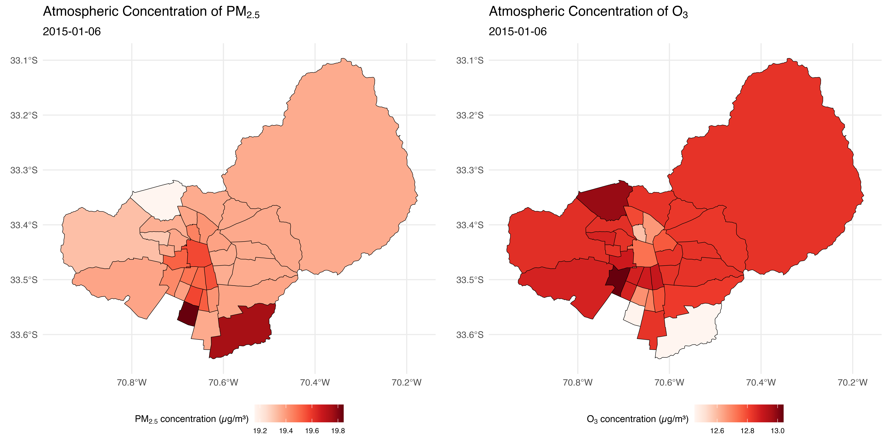
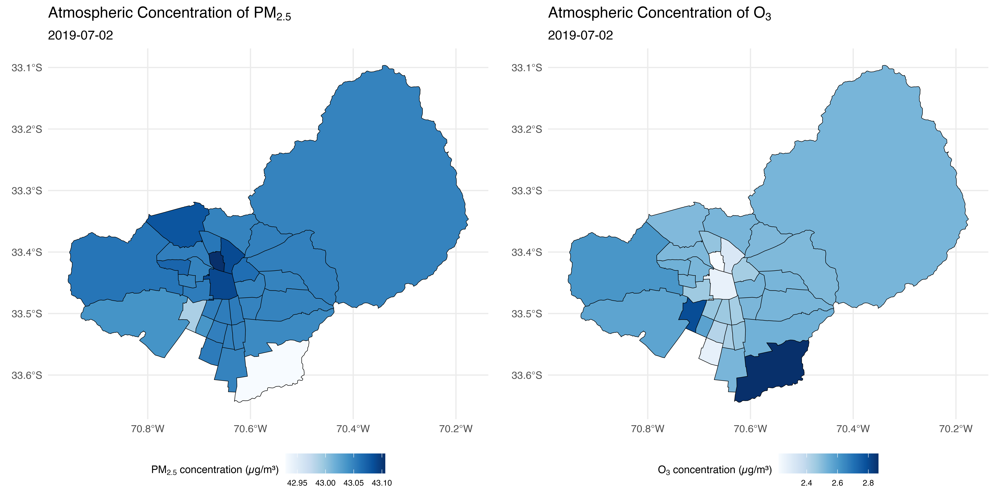

# Ordinary Kriging for Atmospheric Pollutans (Ozone and Particulate Matter 2.5) Interpolation
Repository for the interpolation process using ordinary kriging for the concentrations of two atmospheric pollutants (ozone and particulate matter 2.5) across all municipalities within the Santiago metropolitan area, using data from the National Air Quality Information System (SINCA) of the Ministry of the Environment.

Fondecyt Nº 11240322: Climate change and urban health: how air pollution, temperature, and city structure relate to preterm birth.

💰 Funding: Fondecyt de Iniciación en Investigación Nº 11240322. Año 2024.

📬 Estela Blanco (estela.blanco@uc.cl) - Principal Researcher

📬 José Daniel Conejeros (jdconejeros@uc.cl) - Research Assistant

📬 Ismael Bravo (ibravor@estudiante.uc.cl) - Research Assistant

Falta:

Data --> comunas.shp

Results --> exposure.csv

