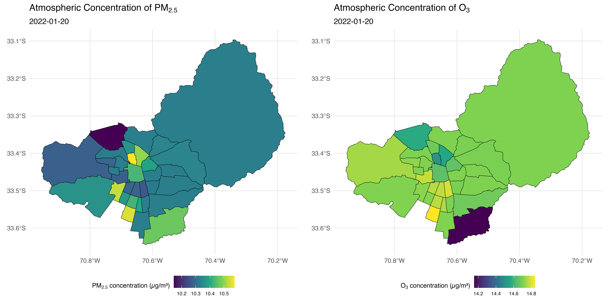

# Ordinary Kriging for Atmospheric Pollutans (Ozone and Particulate Matter 2.5) Interpolation :city_sunrise:

Repository for the interpolation process using ordinary kriging for the concentrations of two atmospheric pollutants (ozone and particulate matter 2.5) across all municipalities within the Santiago metropolitan area, using data from the National Air Quality Information System (SINCA) of the Ministry of the Environment.

**Fondecyt Nº 11240322**: Climate change and urban health: how air pollution, temperature, and city structure relate to preterm birth.

:moneybag: Funding: Fondecyt de Iniciación en Investigación Nº 11240322. Año 2024.

:mailbox_with_mail: Estela Blanco (<estela.blanco@uc.cl>) - **Principal Researcher**

:mailbox_with_mail: Ismael Bravo (ibravor@estudiante.uc.cl) - Research Assistant

:mailbox_with_mail: José Daniel Conejeros (<jdconejeros@uc.cl>) - **Research Assistant**

## Methodology

The study aims to interpolate the spatial distribution of PM2.5 and O3 concentrations in Santiago's metropolitan area using ordinary kriging. This research is part of the FONDECYT Initiation Project No. 11240322, which examines the relationship between air pollution, temperature, and urban structure with preterm birth. The data includes air pollution measurements from 10 official monitoring stations of the SINCA network, supplemented by an additional station in Talagante. Birth records containing information on 916,955 newborns were also used to estimate prenatal exposure to air pollutants. The study georeferenced municipal buildings to interpolate pollution levels at administrative centers and applied spatial interpolation techniques to estimate exposure in different communes. Given the large dataset, covering pollution data from 2009 to 2020, challenges arose in fitting appropriate variogram models due to the variability and structure of the data.

The methodology employed ordinary kriging to generate interpolated pollution surfaces for different time periods. Initially, gstat was used for model fitting, but inconsistencies in variogram estimation led to adopting automap, which offers automatic variogram selection and improved stability in interpolation results. The kriging models were adjusted for 4,383 unique dates, leading to 8,766 kriging models (one per date and pollutant). The exposure estimation considered three windows: four days before birth, one month before birth, and the entire gestational period. A final dataset was created, linking interpolated pollution estimates to birth records, facilitating epidemiological analysis. 

 **Data and Code**: You can run code 01. to 07. with the data table `pollution.csv` downloading the data table [here](https://github.com/ClimChange-NewbornHealth/Pollution_Kriging/tree/main/Data).

## Principal Findings :sunny: :snowflake:

**Figure 1.** Location of Monitoring Stations and Municipalities in the Study Area.

**Figure 2.** Spatial Distribution of Interpolated Pollution Levels on December 20, 2015.

**Figure 3.** Spatial Distribution of PM2.5 and O3 Concentrations During the Summer Season

**Figure 4.** Spatial Distribution of PM2.5 and O3 Concentrations During the Winter Season

